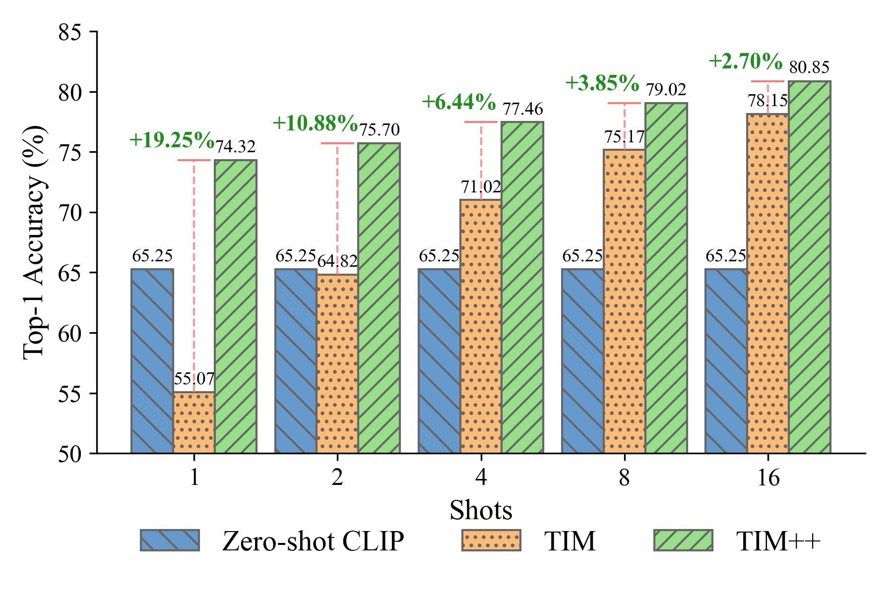

# TIM++: Transductive Information Maximization for Few-Shot CLIP

## Introduction
TIM++ is a enhanced transductive approach built on the standard TIM framework, adapting to few-shot vision-language scenarios by integrating textual information. Specifically, our method introduces a Kullback-Leibler(KL) divergence-based regularization term that encourages the model's predictions to align with CLIP's zero-shot outputs. Additionally, we design an improved prototype initialization strategy guided by CLIP's semantics knowledge. Surprisingly, TIM++ consistently outperformms the standard TIM and surpasses other existing SOTA methods across 11 benchmerk datasets.

<p align="center">
  
  <br>
  <em>Figure 1: TIM++ significantly outperforms standard TIM. Average Top-1 accuracy is reported across 11 public datasets under different shot settings.</em>
</p>

## Table of Contents

1. [Installation](#installation) 
2. [Usage: TIM++ For Few-Shot Learning](#usage-tim++-for-few-shot-learning)
3. [Few-Shot Baselines](#few-shot-baselines)
4. [Acknowledgment](#acknowledgment)
---

## Installation
This repository requires to install an environment and datasets:
### Environment
Create a Python environment with your favorite environment manager. For example, with `conda`: 
```bash
conda create -y --name tim_p2 python=3.10.0
conda activate tim_p2
pip3 install -r requirements.txt
```
And install Pytorch according to your configuration:
```bash
pip3 install torch==2.0.1 torchaudio==2.0.2 torchvision==0.15.2
```
### Datasets
Please follow [DATASETS.md](DATASETS.md) to install the datasets.
You will get a structure with the following dataset names:
```
$DATA/
|–– imagenet/
|–– caltech-101/
|–– oxford_pets/
|–– stanford_cars/
|–– oxford_flowers/
|–– food-101/
|–– fgvc_aircraft/
|–– sun397/
|–– dtd/
|–– eurosat/
|–– ucf101/
```

## Usage: TIM++ For Few-Shot Learning
We present the basic usage to get started with TIM++. You have to pass the datasets folder path and the pre-computed prototypes folder path. Each script has pre-set parameters but you can change them manually.

Here is an example for the imagenet dataset, with the CLIP-ViT-B/16 architecture, and seed 1:
```bash
python3 main.py --root_path /path/to/datasets/folder --dataset imagenet --method tim_p2 --backbone vit_b16 --shots 2 --seed 1
```

To run the whole experiment, use the following command:
```bash
bash ./scripts/run_tim_p2.sh /path/to/datasets/folder vit_b16 1
```

## Few-Shot Baselines
### Transductive Vision-Only Baselines

To run the transductive vision-only baselines, use (and modify) the following command:

```bash
bash ./scripts/transductive_baselines.sh /path/to/datasets/folder vit_b16 transductive_finetuning 2
```
You can select among `{transductive_finetuning; bdcspn; laplacian_shot; ptmap; tim}`.

### Inductive Linear-Probe Baselines

To run the inductive linear probe(LP) baselines, use (and modify) the following command:

```bash
bash ./scripts/inductive_baselines_lp_family.sh /path/to/datasets/folder LinearProbe 4
```

### Transductive Vision-Language Baselines

To run the TransCLIP, use (and modify) the following command:

```bash
bash ./scripts/transductive_baselines.sh /path/to/datasets/folder vit_b16 TransCLIP 4
```

To run the LP++, use (and modify) the following command:

```bash
bash ./scripts/inductive_baselines_lp_family.sh /path/to/datasets/folder LinearProbe_P2 4
```

## Acknowledgment
This repository is primarily based on TransCLIP and LP++. 
We are grateful for their excellent work and will include the corresponding GitHub links once the paper is accepted.
